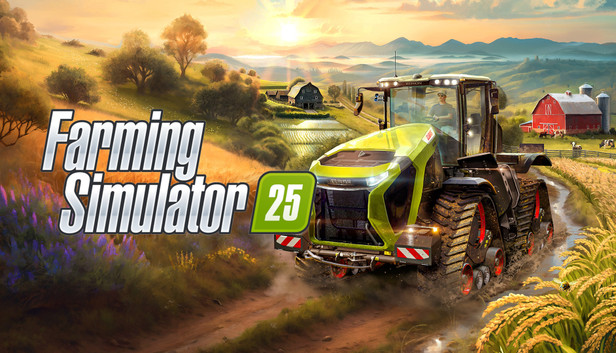

 

# Yurg's Custom Pack

Other vehicules, implements and customisations to be added later on, but it might already be usefull for some people.

Some ayatollahs, who believe that everyone should play like them, seems to have great fun giving a single star to any mod that does not interest them or does not seems real to them.
Therefore do not hesitate to rate the mod after you have tested it, and/or add a comment if something is not right for you.

Your comments and suggestions are welcome.

> [!TIP]
> You can use the table of contents menu in the upper right corner to find what you're looking for more easily.
> 

## Equipments updates

Here is a list of adjustments made on all vehicles and implements:
- lifetime of vehicle used to calculate price drop, in months (x10)
- time to complete worn (x10)
- motor start duration reduced to 1.5s
- additional color customisations (except Krone)

And the ones made on some vehicles and implements:
- additional motors (real hp based on torque, rpm...) with higher travel speeds (and fuel consumption)
- additional fuel tank size options
- customized gearbox options from the manufacturers
- higher working speed (24 or 35kph)
- higher discharge rate
- optional additional plow or roller function
- optional working widths
- optional unreal filling capacities
- optional trailer hitch

## Main Vehicles

### Trucks

#### Lizard Dragon
- 1 additional motor with higher travel speed (340hp 110kph)
- additional optional unreal filling capacities
- additional optional trailer hitch
- additional color customisations

#### Lizard Dragon Electric
- new electric vehicle based on the diesel one
- 1 additional motor with higher travel speed (340hp 110kph)
- additional optional unreal filling capacities
- additional optional trailer hitch
- additional color customisations

#### Volvo FH16
- higher base motors gearboxes updated using real options from the manufacturer, adding some low gears with higher torque
  - ATO3112F ASO-C
  - ATO3512F ASO-ULC
  - ATO3512F ASO-ULC ARSO-MSR
- two additional motors with higher travel speed (850hp 110kph and 950hp 120kph)
- additional optional trailer hitch (usefull to move dolly..)
- additional color customisations

#### Volvo FH16 Electric
- 1 additional motor with higher travel speed (825hp 110kph)
- additional optional trailer hitch (usefull to move dolly..)
- additional color customisations

### Large Tractors

#### Valtra S Series
- 3 additional motors with higher travel speed (520hp 63kph, 620hp 73kph, 820hp 83kph)
- additional fuel tank options (670, 730, 790, 850L)
- additional color customisations

#### Small Tractors:

#### Antonio Carraro Mach 4R
- 5 additional motors with higher travel speed (up to 236hp 74kph)
- additional fuel tank options (60, 70L)
- additional color customisations

## Trailers

### Bulk trailers

#### Krampe Big Body 750 S
- higher discharge rate
- optional unreal filling capacities
- optional trailer hitch
- additional color customisations

#### Krampe RamBody AS 750+
- higher discharge rate
- optional unreal filling capacities
- additional color customisations

#### Krampe SKS 30/1050
- higher discharge rate
- optional unreal filling capacities
- optional trailer hitch
- additional color customisations

#### Krone GX 520
- higher discharge rate
- optional unreal filling capacities
- additional color customisations

### All Liquids Trailers

#### Abi 550
- higher discharge rate
- optional unreal filling capacities
- additional color customisations

#### Abi 1600
- higher discharge rate
- optional unreal filling capacities
- optional trailer hitch
- additional color customisations

#### Lizard MKS 8
- higher discharge rate
- optional unreal filling capacities
- optional trailer hitch
- additional color customisations

#### Lizard MKS 32
- higher discharge rate
- optional unreal filling capacities
- optional trailer hitch
- additional color customisations

### Others

#### Krampe Dolly 10 L
- additional color customisations

## Fields preparation

### Sprayers

#### Agrifac Condor Endurance II
- 1 additional motor with higher travel speed (620hp 80kph)
- optional unreal filling capacities
- additional color customisations
- additional color customisations

### Slurry  Spreaders

#### Samson Agro PG II 28 Genesis
- optional unreal filling capacities
- additional color customisations

#### Samson SBH4 36
- higher working speed (35kph)
- optional working widths

### Manure Spreaders

#### Samson US 235 Dynamic
- higher working speed (35kph)
- optional working widths
- optional unreal filling capacities
- additional color customisations

### Planters

#### Agco Planter 4905
- rebranded as Agco (other brand decals replaced by Agco)
- multifruit (crops, root fruits, rice...)
- higher working speed (35kph)
- optional additionnal roller function
- optional unreal filling capacities
- additional color customisations

## Combine Harvesters

### Combine Harvesters

#### Agco Ideal
- rebranded as Agco (other brands decals replaced by Agco)
- base motors travel speed updates (680hp 50kph, 790hp 60kph)
- 1 additional motor with higher travel speed (900hp 70kph)
- fuel tank size is modified depending on the chosen motor
- optional unreal filling capacities
- additional color customisations

### Corn Headers for Agco Ideal

#### Agco C16F
- rebranded as Agco (other brands decals replaced by Agco)
- combine attachment adjusted to the size of the Agco Ideal
- higher working speed (35kph)
- additional color customisations

### Grain Headers for Agco Ideal

#### Agco FD250 FlexDraper®
- rebranded as Agco (other brands decals replaced by Agco)
- combine attachment adjusted to the size of the Agco Ideal
- higher working speed (35kph)
- additional color customisations

#### Agco FD250 Multifruit
- rebranded as Agco (other brands decals replaced by Agco)
- combine attachment adjusted to the size of the Agco Ideal
- multifruit (generate a lot of errors)
- higher working speed (35kph)
- additional color customisations

#### Agco HDHT 52 for FD250
- higher working speed (35kph)
- additional color customisations

#### Agco DynaFlex 9255 40FT
- higher working speed (35kph)
- additional color customisations

#### Agco PowerFlow 30FT & 40FT
- higher working speed (35kph)
- additional color customisations

### Grain Headers for other Combines

#### MacDon FD250 FlexDraper®
- higher working speed (35kph)

#### MacDon FD250 Multifruit
- higher working speed (35kph)
- multifruit (generate a lot of errors)

## Forage Harvesters

### Forage Harvester

#### Krone BiG X 1180
- 3 additional motors with higher travel speed (1500hp 53kph, 1800hp 63kph, 2100hp 73kph)
- silage additive increased capacity
- higher discharge rate (to avoid a bottleneck due to higher working speed)

### Forage Headers

#### Krone X-Collect 900-3
- higher working speed (35kph)

#### Krone XDisc 620
- higher working speed (35kph)

#### Krone EasyFlow 300 S
- higher working speed (35kph)

## Grass, Hay and Straw

### Mowers

#### Krone BiG M 450

### Balers

#### Krone BiG Pack 1290 HDP VC

#### Krone VariPack V 190 XC Plus (with prechamber)

### Bales

All bales are liftable

### Loader Wagons

#### Bergmann Shuttle 490 S

## Materials Handling

### Telehandlers

#### Merlo MF44.9CS-170-CVTRONIC

#### All Magsi Telehandler tools

### Skid Steers

#### Kubota SVL 97-2

#### All Paladin Skid Steer tools

## Grapes & Olives

### Grapes & Olives Harvesters

#### Gregoire GL

### Grapes & Olives Tools

#### Agrisem Disc-O-Vigne (Plow or Subsoiler)

#### TMC Cancela TPN 140

#### Farmtech Variofex 750

#### Hardi Mercury 4000L

## Livestock

### Rudolf Hörmann Placeables

#### 5000 Chickens Barn

#### 1000 Cows Barn

#### 1000 Cows Barn with Lely Vector

#### 3000 Pigs Barn

#### 1000 Sheeps Barn

### Other Placeables

#### Two Bee Hives (500 & 2500 L/day)

### Livestock Pallets

#### Eggs Boxes
- Liftable (x10 capacity & price)

#### Goat Milk Cans
- Liftable (x10 capacity & price)
- can fill a liquid trailer
- can be stored in some silos (faster than filling a trailer)

#### Wools
- Liftable (x10 capacity & price)

#### Honey
- Liftable (x10 capacity & price)

## Consumables

### Liftable Consumables (x5 capacity & price)
- Seeds, Fertilizer, Lime, Herbicide, Sillage additive
- Chicken, Horse and Pig Food, Mineral Feed
- Road Salt

### Liftable Consumables
- Bale Net, Bale Twine, Rani Wrap
- Rice, Poplar and Trees saplings

## Silos

### Agco Multi Silo (rebranded)
- Capacity of 10 000 000 for Bulk & Liquids
- Can load from Pallets & BigBags
- With or Without silo extension

### Liquid Manure Tank & Small Extension
- Larger Capacity (x10)
- Faster Loading (x5)
- Conversion from Digestate to Slurry increased
- Liquid Manure base tank support extension increased to 500m

### Manure Heap & extension
- Larger Capacity (x5)
- Faster Loading (x5)
- Manure Heap now support extension, same as Liquid Manure base tank

## Production

### Agco Multi Prod (rebranded)
- Grass dryer
- Grass and/or Chaff silage
- Forage & Pig Food mixer
- With or Without silo extension

# Compatibility issues

### Unlimited Color Configurations [#1](https://github.com/YurgFS/FS25_Yurg_Custom_Pack/issues/1)

It is messing up with some of the “material type” settings on some vehicles.

Issue 0027127 still on going on GIANTS Software side. (it is one of their mods)

### Pallets update mods

It is not recommended to use mods that update pallets as it may interfere with this mod, and specially those ones:
- Liftable Pallets And Bales
- Larger capacity pallets

# Support

For any issue, suggestion or question, please use one of the following:
- https://github.com/YurgFS/FS25_Yurg_Custom_Pack/issues/new/choose
- https://www.kingmods.net/en/search?games=fs25&q=Yurg+Custom+Pack

# Recommend Mods

Here is a list of mods I do recommend:
- https://www.kingmods.net/en/fs25/packs/3529/recommended-mods

# Licence

<picture>
  <source media="(prefers-color-scheme: dark)" srcset="res/cc/cc-logo-white.svg">
  <source media="(prefers-color-scheme: light)" srcset="res/cc/cc-logo-black.svg">
  
</picture>
<picture>
  <source media="(prefers-color-scheme: dark)" srcset="res/cc/cc-by-white.svg">
  <source media="(prefers-color-scheme: light)" srcset="res/cc/cc-by-black.svg">
  
</picture>
<picture>
  <source media="(prefers-color-scheme: dark)" srcset="res/cc/cc-nc-white.svg">
  <source media="(prefers-color-scheme: light)" srcset="res/cc/cc-nc-black.svg">
  
</picture>
<picture>
  <source media="(prefers-color-scheme: dark)" srcset="res/cc/cc-nd-white.svg">
  <source media="(prefers-color-scheme: light)" srcset="res/cc/cc-nd-black.svg">
  
</picture>

Yurg's Custom Pack © 2024 by Yurg is licensed under Creative Commons Attribution-NonCommercial-NoDerivatives 4.0 International.
- BY: Credit must be given to the creator.
- NC: Only noncommercial use of my work is permitted.
- ND: No derivatives or adaptations of my work are permitted.

To view a copy of this license, visit [CC BY-NC-ND 4.0](https://creativecommons.org/licenses/by-nc-nd/4.0/)

# Download

Only use the download link provided in the latest version:
- https://github.com/YurgFS/FS25_Yurg_Custom_Pack/releases/latest

> [!CAUTION]
> Uploading all or part of this mod on another website is not permitted (only noncommercial use of my work is permitted).
