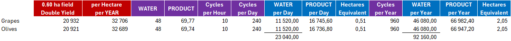
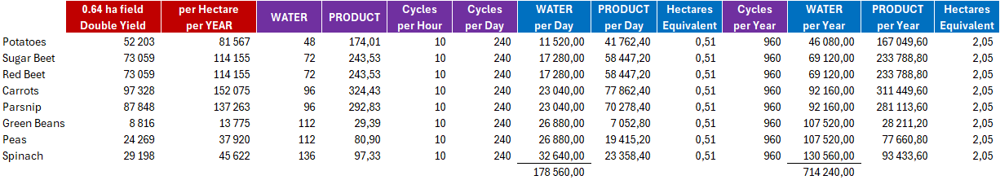

# Food Productions

## Greenhouses

### Large Glass Greenhouse
- no daily upkeep fee
- reduction of cost per hour
- production increased (x10)
- input storage increased (x20)
- output storage increased (x10)

### Large Mushrooms Greenhouse
- no daily upkeep fee
- reduction of cost per hour
- production increased (x10)
- input storage increased (x20)
- output storage increased (x10)

### Large Sapling Greenhouse
- no daily upkeep fee
- reduction of cost per hour
- production increased (x10)
- input storage increased (x20)
- output storage increased (x10)

### Grapes & Olives Greenhouse

- based on the Large Mushrooms Green House
- no daily upkeep fee
- low cost per hour

### Vegetables Greenhouse

- based on the Large Tarp Green House
- Potatoes, Sugar Beets, Beet Roots, Carrots, Parsnips, Green Beans, Peas, Spinach
- no daily upkeep fee
- low cost per hour

### All in One Greenhouse
- based on the Large Mushrooms Green House
- Lettuces, Strawberries, Tomatoes, Spring Onions, Napa Cabbages, Chillis, Garlics, Enokis, Oysters,
- Grapes, Olives, Potatoes, Sugar Beets, Beet Roots, Carrots, Parsnips, Green Beans, Peas, Spinachs

## Food Production Points

### Grain Mill
- no daily upkeep fee
- reduction of cost per hour
- production increased (x10)
- output storage increased (x10)
- input storage increased (x20)

### Sugar Mill
- no daily upkeep fee
- reduction of cost per hour
- production increased (x10)
- output storage increased (x10)
- input storage increased (x20)

### Dairy
- no daily upkeep fee
- reduction of cost per hour
- production increased (x10)
- output storage increased (x10)
- input storage increased (x20)
- same cost for bottling all milk types

### Bakery, Bakery (AS), Bakery (EU)
- no daily upkeep fee
- reduction of cost per hour
- production increased (x10)
- output storage increased (x10)
- input storage increased (x20)

### Grape Processing
- no daily upkeep fee
- reduction of cost per hour
- production increased (x10)
- output storage increased (x10)
- input storage increased (x20)

### Cereal Factory
- no daily upkeep fee
- reduction of cost per hour
- production increased (x10)
- output storage increased (x10)
- input storage increased (x20)

### Preserved Food Factory (EU)
- no daily upkeep fee
- reduction of cost per hour
- production increased (x10)
- output storage increased (x10)
- input storage increased (x20)

### Preserved Food Factory (AS)
- twice the values of the EU variant, since it is more than twice as large
- addition of Soup Factory productions
- renamed "l10n_shopItem_preservedFoodFactory (l10n_shopItem_soupFactory)"
- price increased (330000+330000)*1.15
- no daily upkeep fee
- reduction of cost per hour
- production increased (x20)
- output storage increased (x20)
- input storage increased (x40)

### Soup Factory
- no daily upkeep fee
- reduction of cost per hour
- production increased (x10)
- output storage increased (x10)
- input storage increased (x20)

### Oil Mill
- no daily upkeep fee
- reduction of cost per hour
- production increased (x10)
- output storage increased (x10)
- input storage increased (x20)

### Potato Processing Plant
- no daily upkeep fee
- reduction of cost per hour
- production increased (x10)
- output storage increased (x10)
- input storage increased (x20)
