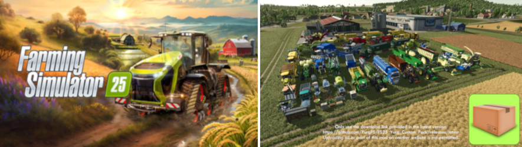

# Support

For any problems, suggestions or questions, please create an issue using one of the following addresses:

[🐞 Bug Report](https://github.com/YurgFS/FS25_Yurg_Custom_Pack/issues/new?template=01-bug_report.yml)

[🪛 Enhancement Request](https://github.com/YurgFS/FS25_Yurg_Custom_Pack/issues/new?template=02-enhancement_request.yml)

[💡 Feature Request](https://github.com/YurgFS/FS25_Yurg_Custom_Pack/issues/new?template=03-feature_request.yml)

[🛡️ Security Issue](https://github.com/YurgFS/FS25_Yurg_Custom_Pack/security/policy)

[❓ Other Requests](https://github.com/YurgFS/FS25_Yurg_Custom_Pack/issues/new?template=04-other_requests.yml)

### Ongoing Issues
- [Bug Reports, Compatibility & Known Issues](https://github.com/YurgFS/FS25_Yurg_Custom_Pack/issues?q=is%3Aopen%20label%3Abug%2Ccompatibility%2Cknown-issue%20sort%3Aupdated-desc)
- [Features & Enhancement requests](https://github.com/YurgFS/FS25_Yurg_Custom_Pack/issues?q=is%3Aopen%20is%3Aissue%20label%3Aenhancement%2Cfeature%20sort%3Aupdated-desc)
- [In Progress (Next Version)](https://github.com/YurgFS/FS25_Yurg_Custom_Pack/milestones?state=open)

### A few tips to help you find the root cause
If you are unsure, you can try the following method, this might help you find the root cause of the problem:
- create a new game with [a dedicated test map](https://github.com/YurgFS/FS25_Yurg_Dev_Map/releases/latest) having this mod as the only activated one.
- if everything is fine, restart the test map by adding other mods until the problem re-occurs.

You may do the same with your main game, but be very careful, do not save and beware of auto save.
You will have to make a backup of the game save folder as the first step. You will find it in Documents\My Games\FarmingSimulator2025\savegameX with X as the game save slot between 1 and 20.
