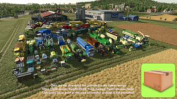

 

# Yurg's Custom Pack

## Equipment updates

Here is a list of adjustments made on all vehicles and implements:
- lifetime of vehicle used to calculate price drop, in months (x10)
- time to complete worn (x10)
- motor start duration reduced to 1.5s
- additional color configurations
    - no color configurations yet for Krone, Ropa, Dewulf, Oxbo and Iseki
    - it requires to include i3d files making the pack size bigger
    - I will probably add some of them, tell me which ones you prefer

And the ones made on some vehicles and implements:
- additional motors (real hp based on torque, rpm...) with higher max speeds (and fuel consumption)
- customized gearbox based on real options from the manufacturers
- additional fuel tank size options
- higher working speed (24 or 35kph)
- higher discharge rate
- optional additional plow or roller function
- optional working widths
- optional unreal filling capacities
- optional trailer hitch

Here is the list of current requests and planed additions:
- [Feature & Enhancement Requests](https://github.com/YurgFS/FS25_Yurg_Custom_Pack/issues?q=is%3Aopen+is%3Aissue+label%3Aenhancement%2Cfeature)

Feel free to create a new issue if you want something.

## Project Contributors

Many thanks to the following people for their contribution:
- [rjwaters0311](https://www.kingmods.net/en/profile/rjwaters0311): sponsor of the project
- [ugoFantozzi](https://www.kingmods.net/en/profile/ugofantozzi): Polish translation

## Recommended Mods

Here is a list of mods I do recommend:
- https://www.kingmods.net/en/fs25/packs/3529/recommended-mods

## Compatibility issues

Please avoid mods that update the color list without first checking if it is a Material Type list and not a Color list.

- `Unlimited Color Configurations` by GIANTS Software [#1](https://github.com/YurgFS/FS25_Yurg_Custom_Pack/issues/1)

Please avoid mods that update the working width of equipments with some fixed value without first checking if the current value is higher or not.

- `Increased Work Areas for Pickups` by Ifko[nator] [#49](https://github.com/YurgFS/FS25_Yurg_Custom_Pack/issues/49)

Please avoid mods that update pallets as it may interfere with this mod. *And specially the Livestock pallets (x10) if you are using the updated barns because the pallet spawn area will be too small.*

- `Liftable Pallets And Bales`  by Jos [#50](https://github.com/YurgFS/FS25_Yurg_Custom_Pack/issues/50)

- `Larger capacity pallets` by Virgile0, TopAce888, pipopaaulus [#51](https://github.com/YurgFS/FS25_Yurg_Custom_Pack/issues/51)

## Support

For any issue, suggestion or question, please create an issue using the following address:
- https://github.com/YurgFS/FS25_Yurg_Custom_Pack/issues/new/choose

## Licence

   

Yurg's Custom Pack © 2024 by Yurg is licensed under Creative Commons Attribution-NonCommercial-NoDerivatives 4.0 International.
- BY: Credit must be given to the creator.
- NC: Only noncommercial use of my work is permitted.
- ND: No derivatives or adaptations of my work are permitted.

To view a copy of this license, visit [CC BY-NC-ND 4.0](https://creativecommons.org/licenses/by-nc-nd/4.0/)

## Download

Only use the download link provided in the latest version:
- https://github.com/YurgFS/FS25_Yurg_Custom_Pack/releases/latest

> [!CAUTION]
> Uploading all or part of this mod on another website is not permitted (only noncommercial use of my work is permitted).
